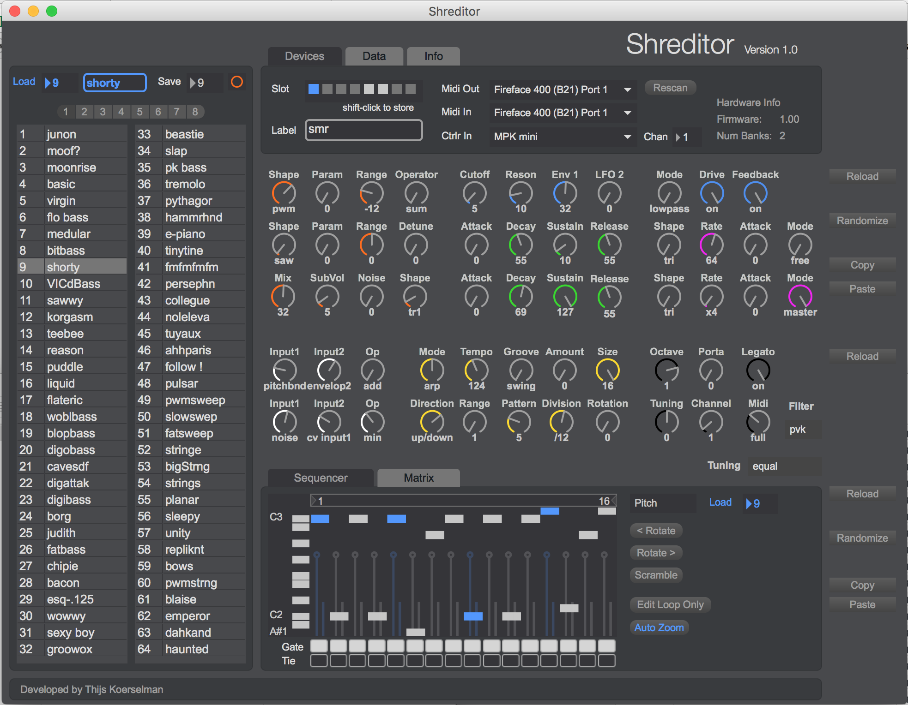

# Shreditor

## TODO before release
* update info tab in shreditor to point to github instead of support
* test eeprom transfer
* put new builds on vauxlab
* licentie toevoegen en boven files plaatsen
* delete doc folder from vauxlab/downloads/shreditor
* squash all old commits van voor april 11 2015
* test bidirectional communication
* als midi op full staat lijkt de request niet goed te gaan. Firmware en numbanks requests komen in 1 sysex message terecht lijkt het wel. 0b (numbanke) en 0c (firmware)

## Description
An editor for the [Shruthi-1](http://mutable-instruments.net/shruthi1) DIY synthesizer. A compact hybrid synth combining 8-bit oscillators with an analog filter.

The editor application is built with [Max](https://cycling74.com/products/max), but the core of the software is a custom Max object written in C++ called vx.shruthi. The object takes care of all the MIDI communication and data management.

The patches and externals should work with both Max v6 and v7

## Features
* Control all relevant parameters including matrix, sequencer and settings
* Bidirectional communication. Active update of patch and sequence data in the interface
* Edit up to 8 devices simultaneously
* Copy and paste patches and sequences between devices
* Quick patch browsing and naming
* Import and export of eeprom data

There are also some things you can not do on a Shruthi without the Shreditor:

* Load/browse a sequence of one patch while keeping the sound of the current one (xt)
* Copy-paste patches and sequences between slots and different devices
* Scramble sequence notes (keeping the pitch and velocity but randomize its position)
* Rotate sequence notes within the loop

## Requirements
Shruthi-1 with firmware >= v1.0. The firmware update instructions are found below.

## Usage
The documentation on how to use the application can be found in __docs/user-manual.md__. Build instructions for OSX and Windows are listed below.

## Known Issues
* Firmware version, for example 1.02, is wrongly reported as 1.00 in the interface.

## Troubleshooting
### No compatible Shruthi firmware version was detected on this port.
On switching device presets the Shreditor will send out some sysex commands to validate the device firmware and the number of memory banks it has (this can vary based on the built hardware).

If you get this message, make sure your device has the required firmware, and check that the physical connections of the MIDI ports are correct. You can use a tool like Midi Monitor on OSX to check your MIDI i/o.

### The Shruthi doesn't play notes or switch presets
The MIDI channel on which the Shruthi is listening can be found in the bottom right corner, above the sequencer. When you switch device presets in the Shreditor, it gets its data from the previously stored eeprom copy. If you use the software to mirror the same device on two different device slots, the MIDI channel setting could be different from the actual hardware setting, and the software could send data on the wrong channel. Tweak the channel setting to correct it and save the device preset (shift-click on the slot). Note that this settings uses sysex, which is channel independent, so it will

### I am using multiple devices and things are messed up
Don't connect multiple Shruthi devices on the same physical MIDI port. The Shreditor uses sysex to communicate and because this is channel independent having more than one device on the same port will cause conflicts.

## Folder Structure
.
├── build : Prebuilt documentation and Shruthi-1 firmware
├── c74support : Max object SDK, as copied from Cycling '74
├── docs : User manual
├── notes : Some development related notes
├── objects : XCode & Visual Studio projects for building the vx.shruthi object
└── shreditor : Max Shreditor project files

## Prebuilt binaries
The prebuilt Shreditor binaries can be found [here](. If you want to build it from source, read on.

## Build the Shreditor for OSX

1) Build the vx.shruthi object using the project at __objects/Shreditor.xcodeproj__. If you hit cmd+b should output __vx.shruthi.mxo__ at __objects/bin__.

You can enable debugging output to the Max console by switching the build to development mode. Go to "edit (build) scheme" and select "development" as the build configuration in the "run" section. This will enable all DPOST macros to output their message to the Max console.

2) Copy the vx.shruthi.mxo file to shreditor/externals. This makes it available to the Max project

3) Open shreditor/Shreditor.maxproj (requires Max 6 or 7). Hit cmd + m to open the Max console. It should not display any errors.

At this point you are already able to use the Shreditor, but if you want to build a standalone application proceed to the next step.

4) Export the standalone application by going to __File > Build Collective / Application__. In the next window select __Application__ from the "File Format" menu at the bottom. Save the application somewhere on your system.

The resulting file should be an .app bundle containing an export of all the files plus the runtime core of Max to form a standalone application.

Addionally you can strip the app bundle of some unneccesary files to make it smaller. Right-click -> Show package content, and then remove:

* resources/c74/extensions/max/clang (36Mb)
* resources/c74/externals/msp
* resources/c74/externals/jitter
* resources/c74/media

## Build the Shreditor for Windows

## Update the device firmware
The most up to date official firmware (v1.02) can be found in the build/firmware folder. To transfer the firmware, hold the rightmost switch on the device while powering on. Use a sysex tool like Elektron's C6 to transfer the firmware.

In the C6 settings you'll have to set the "delay ticks" to something like 15, otherwise the transfer goes too fast and the last few leds on the Shruthi-1 won't get to blinking.

## Editing the Shreditor patch
The patch (and all of its abstractions) opens in __presentation mode__. Hit __cmd + alt + e__ to switch to patching mode.

In order to prevent window resizing by the user, the maximum window dimensions are limited to 980x830 to neatly contain just the UI and fit it on a 12" laptop screen. You can increase the maximum size by clicking on the message in the top right corner saying `window constrain 200 200 1500 1500, window exec` which sets the maximum dimensions to 1500x1500.

## Additional Development Notes
There are some additional notes [here](/notes). If you want to help out with development maybe look at the section about [this needs work](/notes/this%20needs%20work.md)

