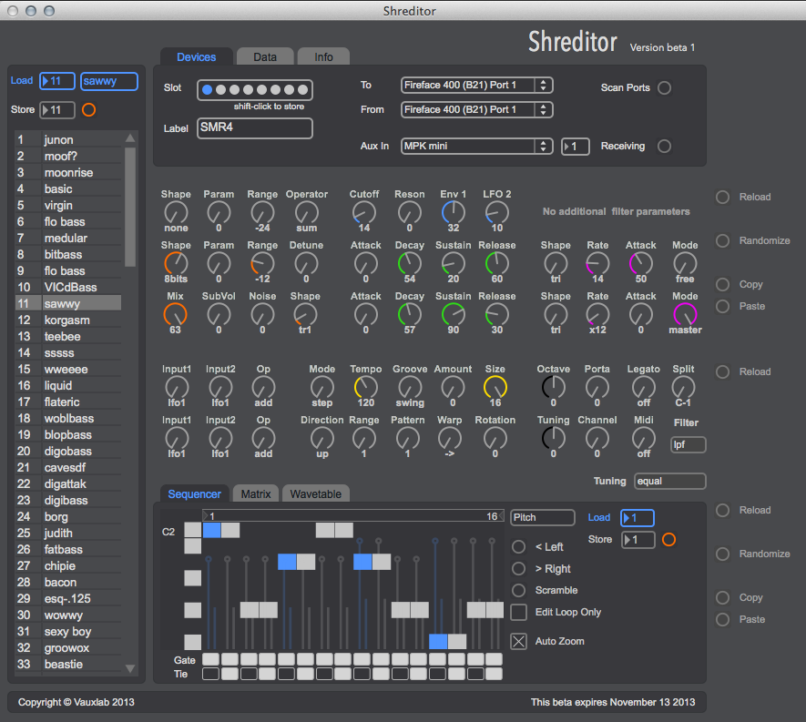

Shreditor User Manual
=================
*Revision: 2, November 13 2013 *
Author: Thijs Koerselman

###!! Disclaimer
Please back up your data first. This is beta software. I will not feel responsible for corrupting or loosing your precious data.

1. Getting Started
------------------
These are the steps to get you up and running quickly.

###Step 1: Update the Firmware
The Shreditor will only work with Shruthi-1 firmware versions >= 0.98. At the time of writing this version is not yet released. The correct firmware should be included in the Shreditor software bundle as a midi and sysex file.

###Step 2: Configure the Midi Ports
A lot of functionality in the Shreditor uses midi sysex commands. Sysex is not tied to a specific channel, which means that all devices with the same device id (like multiple Shruthi's) connected to a port will all respond to the sysex messages passed on that port. So __make sure__ each of your Shruthi devices is connected to a different midi port when using the Shreditor.

Configure the connections to your device. The in and out ports are used for all the data traffic from the editor. The aux is an extra input to the Shruthi and can be used to connect a keyboard or other midi source to play the device.

###Step 3: Store the Device Settings
After setting up all the midi ports, give the device a label if you haven't already. Use an easy reference to tag this specific Shruthi device like "4 Pole Mission". This label is only used for display to remind you what device you are editing.

Now we are ready to save these settings in one of the 8 available device slots. At first all of the slots will white, indicating that they are empty. Store the preset in one of the slots by hitting [shift-click]. The slot color will change to dark grey (meaning it is filled) and then blue (which means it is active). Up to 8 different devices can be configured this way.

###Step 4: Initialize the Mirror
In order minimizes the transfer of data with the device and to keep the UI responsive, the Shreditor keeps a mirror of the device eeprom storage at all time. This way, when you load a patch, the editor already knows all of the settings and you can quickly navigate without having to request the data from the device.

To start editing a device you first need to download the internal storage into the editor. You do this by going to the [Data] tab and click on the [download] button. You will see a progress bar indicating status of the data transfer. 

*That's it. Enjoy!*

Please report bugs to __support@vauxlab.com__

###Adding More Devices
If you own more than one Shruthi, and you have enough physical midi ports, you can repeat steps 2-4 for each device. The Shreditor will let you edit these devices simultaneously. You can switch back and forth and it will keep track of your edits. Please note that you *can not* connect multiple devices to the same midi port, since the software communicates with sysex and sysex messages are global and therefor not tied to any midi channel.

2. Shreditor User Manual
-------------------

###2.1 Introduction
...

###2.2 Feature Summary
* Clearly laid out, easy to use interface.
* Control over every (*) available parameter including matrix, sequencer and settings.
* Bidirectional communication. Active update of patch and sequence data in the interface.
* Edit up to 8 devices simultaneously
* Direct low level communication with hardware, bypassing standard Max MIDI objects.
* Device data transfer and mirroring.
* Labeled parameters and ranges.
* Copy and paste patches and sequences between devices.
* Patch list for fast preset browsing and naming.
* Import and export of backups and patches.

*(*) Some settings are deliberately ignored because I don't think they make sense to expose in an editor, like display pause and parameter snap. Also note triggers and cv input are not exposed at the moment. *

###2.3 Overview
... (describe all the different functions of the interface)

###2.4 Firmware
There were numerous additions made to the 0.97 firmware in order to allow the level of control that the Shreditor offers. They will be included in the official 0.98 release when that happens, but until then you can use the supplied firmware midi or hex file that comes with the application bundle.

###2.5 Caveats
Here are some things which I think are with knowing when using the Shreditor, because they might function differently from what you would expect.

####Shruthi Midi Channel
You may have noticed the lack of a midi channel setting in the device midi configuration at the top. That is because the Shreditor can read and control the midi channel setting of the device via sysex. So when you set the correct ports, the Shreditor is already able to get the current midi channel on which the device is listening. You can change the midi channel from the editor by setting the [Channel] parameter in the [System Settings] section of the Shreditor.

####Editing on Device
The editor will reflect most edits you make using the knobs on the device, as long as you have the midi output setting set to CTRL or FULL. I suggest you use CTRL to prevent sysex to be echoes to the output. Beware that system and sequencer settings are not echoed to the output, so you better only edit those from the Shreditor interface or the mirror data will get out of sync. 

####System Settings
The system settings are configurable from the editor, and edits are immediately stored without the confirmation you normally give after editing these parameters on the device directly. 

####Patch Names
* Patch names are max 8 character long. The rest will be truncated. Also Shreditor and Shruthi don't use the same character set for patch names, special characters might differ or show blank on the device.

###2.6 Known Issues
* When switching devices any playing notes can hang on the previous device
* Note trigger settings are not handled at the moment

###2.7 To Be Implemented
Here is a list of things I would like to implement in the future. 

* Max4Live version. This will be a slimmed down version with mostly only parameters relevant for realtime modulation. Sadly this will be for OSX users only. (*) 
* Support for upcoming XT firmware revision
* JSON support for easy backup and sharing of patches
* User wavetable transfer
* Visual feedback to indicate when a patch has been edited

*(*) Porting the Shreditor to Windows revealed a clash between the midi drivers and the standard Max midi objects which doesn't occur with the OSX drivers. On Windows the Shreditor core object can not co-exist with any standard Max midi objects. As the Shreditor application is build as a standalone I was able to overcome this limitation, but in Max for Live this will not work.  *

###2.8 Bugs & Support
Please send any bug reports or support requests to __support@vauxlab.com__